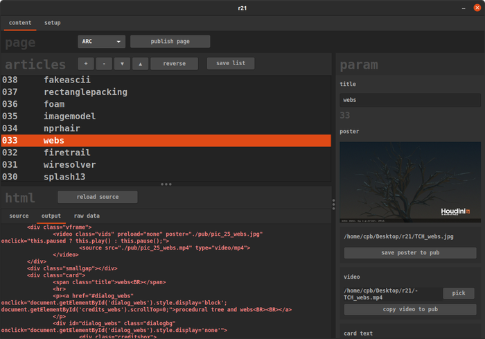

# r21_builder
interface for the 2021 portfolio update

this used to be org-mode + python!

expects:
- ./site_header.html
- ./site_footer.html
- ./txt_template.html
- ./ink_template.html
- ./pic_template.html
- ./arc_template.html
- ./pub/font.ttf
- ./pub/font.wotf

makes:
- ./txt_data.dat
- ./ink_data.dat
- ./pic_data.dat
- ./arc_data.dat

destroys:
- any file it makes/copies to pub: ./pub/[section]_*.*

# todo
- [ ] work around blocked text selection in parameter fields (known Red-GTK issue)
- [ ] add a section data editor to allow use for other sites
- [ ] automatically generate parameters based on section data
- [ ] make functions more generic
- [ ] remove per-item publish
